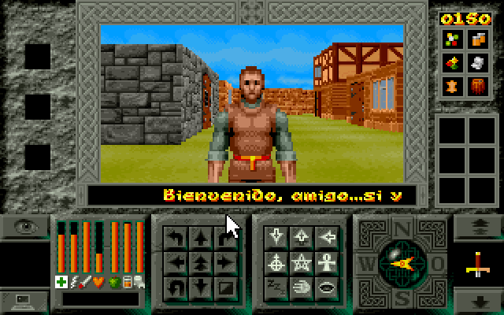
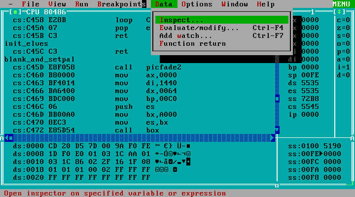

# Legends of Valour (Disassembled)

[Legends of Valour](https://es.wikipedia.org/wiki/Legends_of_Valour) is the first role-playing video game I played. The game was released in 1992 (I was 7 years old) and I was blown away by it: the 3D graphics, how big the city seemed, the day and night cycle, the citizens, the catacombs... it felt like a living world. It's a game that I remember fondly and in 2017 I decided to try and make a kind of web "[remake](https://github.com/AzazelN28/lov)" of it, which can be played [here](https://azazeln28.com/games/lov/).



## Graphics

Extracting the resources was relatively simple, all the `.FCB` and `.FAB` files are actually `.LBM` files, that is, [Deluxe Paint](https://en.wikipedia.org/wiki/Deluxe_Paint) files. From Linux it is super easy to extract all the resources using the `ilbmtoppm` program. The intro animations are `.FLI` files that can be opened with many current players.

## Palettes

The palettes are found in the `.FCB` files and also in the `PALETTES.DAT` file. This `PALETTES.DAT` file has 736 different colors to simulate the different times of day and night.

## Text

The font is located in the `TEXTNIBS.DAT` file, it contains 120 characters and the characters can be painted as follows:

```c
#define TEXTNIBS 3840

// You'll need to load the TEXTNIBS file completely in memory
uint8_t textnibs[TEXTNIBS];

void print_character(uint8_t *textnibs, uint8_t char_code, uint32_t charx, uint32_t chary) {
  const uint8_t height = 8;
  const uint8_t bytes_per_char = 32;

  uint8_t cx = charx;
  uint8_t cy = chary;
  uint8_t index = char_code - 32;
  for (uint8_t y = 0; y < height; y++) {
    // ÑAAAAAARGH!
    uint32_t offset = index * bytes_per_char + y * 4;
    uint16_t cy = y + chary;
    uint8_t width = widths[index];
    while (width > 0) {
      uint8_t current = textnibs[offset];
      uint8_t first_nibble = (current & 0xf0) >> 4;
      if (first_nibble != 0) {
        put_pixel(cx, cy, first_nibble);
      }

      cx++;
      width--;
      if (width > 0) {
        uint8_t second_nibble = current & 0x0f;
        if (second_nibble != 0) {
          put_pixel(cx, cy, second_nibble);
        }
        cx++;
        width--;
      }

      offset++;
    }

    cx = charx;
  }
}
```

The width of each character is directly encoded in the game's code, and the height is 8 pixels. Here's the list of widths:

```
4, 4, 5, 7, 6, 7, 7, 4, 4, 4, 8, 6, 3, 6, 2, 7, 7, 6, 7, 7, 7, 7, 7, 7,
7, 7, 2, 3, 7, 6, 4, 6, 7, 7, 7, 7, 7, 7, 7, 7, 7, 4, 7, 7, 6, 8, 7, 7,
7, 7, 7, 7, 7, 7, 7, 7, 7, 7, 7, 4, 7, 4, 7, 8, 3, 7, 7, 7, 7, 7, 7, 7,
7, 3, 7, 7, 6, 8, 7, 7, 7, 8, 7, 7, 7, 7, 7, 8, 7, 7, 7, 7, 5, 7, 7, 0,
3, 7, 7, 7, 7, 7, 0, 7, 7, 7, 7, 0, 4, 0, 0, 4, 7, 7, 8, 7, 7, 7, 7, 0,
```

Each pixel of the font corresponds to a nibble, that is, half a byte. This way, all characters between 3 and 8 pixels wide by 8 pixels high only take up 3,840 bytes.
## Map

The city map is divided into 3 different files of 32,768 bytes each. The `MAPG0009.DAT` file corresponds to the ground map (`MAPG0008.DAT` in the demo), the `MAPF0009.DAT` file corresponds to the first floor map, and the `MAPU0009.DAT` file corresponds to the catacombs.

The size of the map is 85x128 squares. To represent each square, 3 bytes are needed: the first byte indicates the type of square, whether it has sprites, etc.; the second byte indicates the texture; and the third byte indicates whether there is a second floor.

The arrangement of the squares is as follows, where F corresponds to the first byte of a square, S to the second byte, T to the third byte, and P is padding introduced so that the width of each row is 256 bytes instead of 255 (85 * 3):

```
0 1 2 . . . . . . . . . . . . . . . . . . 255 256
F F F F F F F F S S S S S S S S T T T T T T T T P 0
F F F F F F F F S S S S S S S S T T T T T T T T P .
F F F F F F F F S S S S S S S S T T T T T T T T P .
F F F F F F F F S S S S S S S S T T T T T T T T P .
F F F F F F F F S S S S S S S S T T T T T T T T P .
F F F F F F F F S S S S S S S S T T T T T T T T P .
F F F F F F F F S S S S S S S S T T T T T T T T P 128
```

The first bytes encode several properties in bits:

| bits | description          |
|------|----------------------|
| 0-1  | type of square      |
| 2-4  | type of sprite       |
| 5    | north wall          |
| 6    | west wall          |
| 7    | unknown          |

| type of square | description         |
|-----------------|---------------------|
| 0               | interior            |
| 1               | exterior            |
| 2               | not passable      |

| type of sprite  | description         |
|-----------------|---------------------|
| 0               | no sprite          |
| 1               | lamp             |
| 2               | tree               |
| 3               | column             |
| 4               | table                |
| 5               | dragon egg     |
| 6               | menhir               |
| 7               | vase              |

## Code

The game is divided into three different programs where `LOV.BAT` acts as glue to join them: `TITLE.EXE` which plays the introduction, `CHARDES.EXE` is a character designer and `RUN.EXE` is the game itself. It is done this way because it does not use protected mode, which means that the memory limit of the programs is 640 KB. This has an advantage and that is that disassembling the code is quite simple and many of the decisions made in the design of the game can be understood. However, what made disassembly easier for me was that at the end of `RUN.EXE` is the symbol table exported by Turbo Assembler 2. It is not the first game of the time that I find compiled in "debug mode" or with some kind of debug information, I suppose that the rush and the crunch forced to deliver the "gold" version at the last moment, in the state it was in.

You can find the symbol table in [SYMBOLS.TXT](src/game/SYMBOLS.TXT) and to extract it I used _Turbo Debugger 2.0_.



And to decompile the game I used _The Interactive DisAssembler 3.7_, an old version of the famous [IDA](https://hex-rays.com/ida-free/).


The game does not use scripting languages or interpreters, so all the missions (tasks) are hardcoded in the game's code. As well as the texts (which are found in the last segment `seg003`) and many of the game's constants.

### Curiosities

TODO


Made with :heart: by [AzazelN28](https://github.com/AzazelN28)
