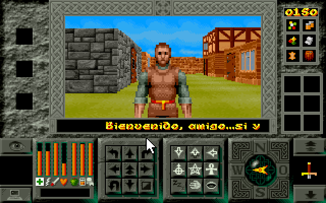
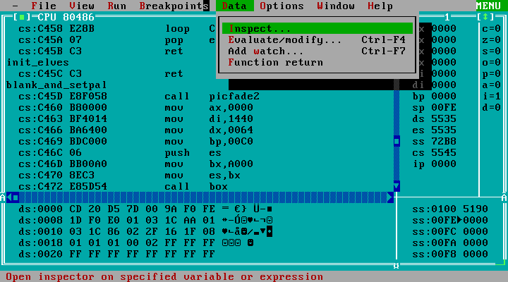
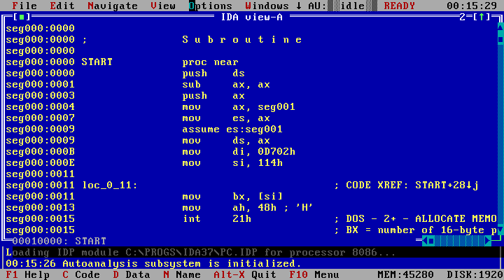

# Legends of Valour (Disassembled)

[Legends of Valour](https://es.wikipedia.org/wiki/Legends_of_Valour) es el primer videojuego de rol al que jugué. El juego salió en 1992 (yo tenía 7 años) y me flipó muchísimo: las 3D, lo grande que parecía la ciudad, el ciclo de dia y noche, los ciudadanos, las catacumbas... parecía un mundo vivo. Es un juego que recuerdo con mucho cariño y en 2017 me dió por intentar hacer una especie de ["remake"](https://github.com/AzazelN28/lov) web que se puede probar [aquí](https://azazeln28.com/games/lov/).



## Gráficos

Extraer los recursos fue relativamente sencillo, todos los archivos `.FCB` y `.FAB` son en realidad archivos `.LBM`, es decir, archivos de [Deluxe Paint](https://es.wikipedia.org/wiki/Deluxe_Paint). Desde Linux es súper fácil extraer todos los recursos usando el programa `ilbmtoppm`. Las animaciones de entrada son archivos `.FLI` que se pueden abrir con muchos reproductores actuales.

## Paletas

Las paletas se encuentran en los archivos `.FCB` y también en el archivo `PALETTES.DAT`. Este archivo `PALETTES.DAT` posee 736 colores diferentes para simular las diferentes horas del día y la noche.

## Texto

La fuente se encuentra en el archivo `TEXTNIBS.DAT`, contiene 120 caracteres y se pueden pintar los caracteres de la siguiente forma:

```c
#define TEXTNIBS 3840

// Necesitarás cargar el archivo TEXTNIBS.DAT completo en memoria.
uint8_t textnibs[TEXTNIBS];

void print_character(uint8_t *textnibs, uint8_t char_code, uint32_t charx, uint32_t chary) {
  const uint8_t height = 8;
  const uint8_t bytes_per_char = 32;

  uint8_t cx = charx;
  uint8_t cy = chary;
  uint8_t index = char_code - 32;
  for (uint8_t y = 0; y < height; y++) {
    // ÑAAAAAARGH!
    uint32_t offset = index * bytes_per_char + y * 4;
    uint16_t cy = y + chary;
    uint8_t width = widths[index];
    while (width > 0) {
      uint8_t current = textnibs[offset];
      uint8_t first_nibble = (current & 0xf0) >> 4;
      if (first_nibble != 0) {
        put_pixel(cx, cy, first_nibble);
      }

      cx++;
      width--;
      if (width > 0) {
        uint8_t second_nibble = current & 0x0f;
        if (second_nibble != 0) {
          put_pixel(cx, cy, second_nibble);
        }
        cx++;
        width--;
      }

      offset++;
    }

    cx = charx;
  }
}
```

Los anchos de cada caracter está codificado directamente en el código del juego, el alto es 8 píxeles. Esta es la lista de anchos:

```
4, 4, 5, 7, 6, 7, 7, 4, 4, 4, 8, 6, 3, 6, 2, 7, 7, 6, 7, 7, 7, 7, 7, 7,
7, 7, 2, 3, 7, 6, 4, 6, 7, 7, 7, 7, 7, 7, 7, 7, 7, 4, 7, 7, 6, 8, 7, 7,
7, 7, 7, 7, 7, 7, 7, 7, 7, 7, 7, 4, 7, 4, 7, 8, 3, 7, 7, 7, 7, 7, 7, 7,
7, 3, 7, 7, 6, 8, 7, 7, 7, 8, 7, 7, 7, 7, 7, 8, 7, 7, 7, 7, 5, 7, 7, 0,
3, 7, 7, 7, 7, 7, 0, 7, 7, 7, 7, 0, 4, 0, 0, 4, 7, 7, 8, 7, 7, 7, 7, 0,
```

Cada pixel de la fuente se corresponde con un _nibble_, es decir, medio byte. De esta forma todos los caracteres de entre 3 y 8 pixeles de ancho por 8 de alto sólo ocupa 3.840 bytes.

## Mapa

El mapa de la ciudad está dividido en 3 archivos diferentes de 32.768 bytes. El archivo `MAPG0009.DAT` corresponde al mapa del suelo (`MAPG0008.DAT` en la demo), el archivo `MAPF0009.DAT` corresponde al mapa de la primera planta y el archivo `MAPU0009.DAT` corresponde a las catacumbas.

El tamaño del mapa es de 85x128 casillas, para representar cada casilla hacen falta 3 bytes, el primer byte indica el tipo de casilla, si la casilla tiene sprites, etc. el segundo byte indica la textura y el tercer byte indica si hay una segunda planta.

La disposición de las casillas es así, donde F se corresponde con los primeros bytes de una casilla, la S con los segundos bytes de una casilla y la T con los terceros bytes de una casilla, el P es un padding que se introduce para que en vez de 255 (85 * 3), el ancho de cada fila sea 256 bytes:

```
0 1 2 . . . . . . . . . . . . . . . . . . 255 256
F F F F F F F F S S S S S S S S T T T T T T T T P 0
F F F F F F F F S S S S S S S S T T T T T T T T P .
F F F F F F F F S S S S S S S S T T T T T T T T P .
F F F F F F F F S S S S S S S S T T T T T T T T P .
F F F F F F F F S S S S S S S S T T T T T T T T P .
F F F F F F F F S S S S S S S S T T T T T T T T P .
F F F F F F F F S S S S S S S S T T T T T T T T P 128
```

Los primeros bytes codifican varias propiedades en bits:

| bits | descripción          |
|------|----------------------|
| 0-1  | tipo de casilla      |
| 2-4  | tipo de sprite       |
| 5    | pared norte          |
| 6    | pared oeste          |
| 7    | desconocido          |

| tipo de casilla | descripción         |
|-----------------|---------------------|
| 0               | interior            |
| 1               | exterior            |
| 2               | no transitable      |

| tipo de sprite  | descripción         |
|-----------------|---------------------|
| 0               | sin sprite          |
| 1               | lámpara             |
| 2               | árbol               |
| 3               | columna             |
| 4               | mesa                |
| 5               | huevo de dragón     |
| 6               | menir               |
| 7               | vasija              |

## Código

El juego está dividido en tres programas diferentes donde `LOV.BAT` funciona como pegamento para unirlos: `TITLE.EXE` que reproduce la introducción, `CHARDES.EXE` es un diseñador de caracteres y `RUN.EXE` es el juego en sí. Está hecho así porque no utiliza modo protegido, esto implica que el límite de memoria de los programas es de 640 KB. Esto tiene una ventaja y es que desensamblar el código es bastante sencillo y se pueden entender muchas de las decisiones tomadas en el diseño del juego. Sin embargo, lo que más me facilitó el desensamblado fue que al final de `RUN.EXE` se encuentra la tabla de símbolos exportada por Turbo Assembler 2. No es el primer juego de la época que me encuentro compilado en "modo debug" o con algún tipo de información de debug, supongo que las prisas y el _crunch_ obligaban a entregar la versión _gold_ en el último momento, en el estado que estuviera.

La tabla de símbolos la tienes en [SYMBOLS.TXT](src/game/SYMBOLS.TXT) y para extraerla he utilizado _Turbo Debugger 2.0_.



Y para decompilar el juego he utilizado _The Interactive DisAssembler 3.7_, una versión antigua del famoso [IDA](https://hex-rays.com/ida-free/).



El juego no utiliza lenguajes de _scripting_, ni intérpretes, así que todas las misiones (_tasks_) están _hardcodeadas_ en el código del juego. Así como los textos (que se encuentran en el último segmento `seg003`) y muchas de las constantes del juego.

### Datos curiosos

TODO


Made with :heart: by [AzazelN28](https://github.com/AzazelN28)
